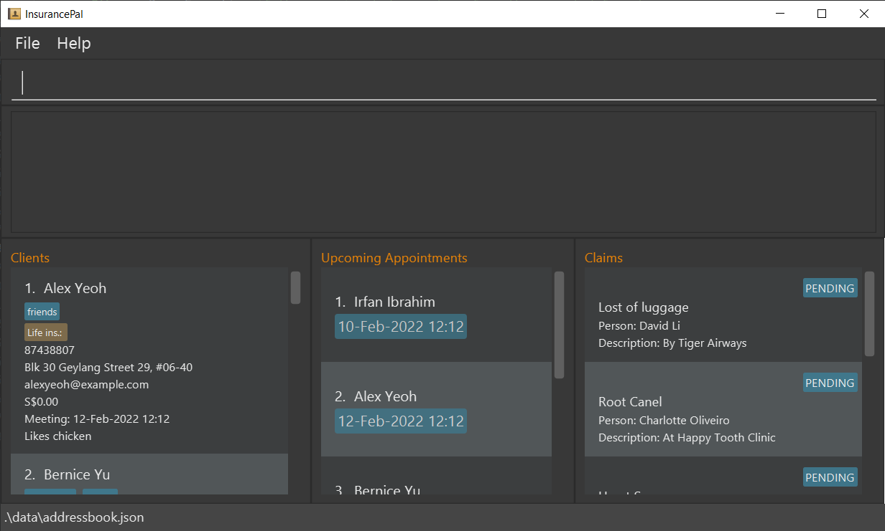
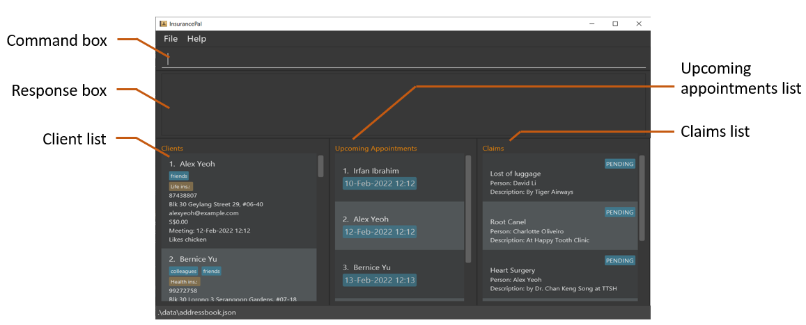
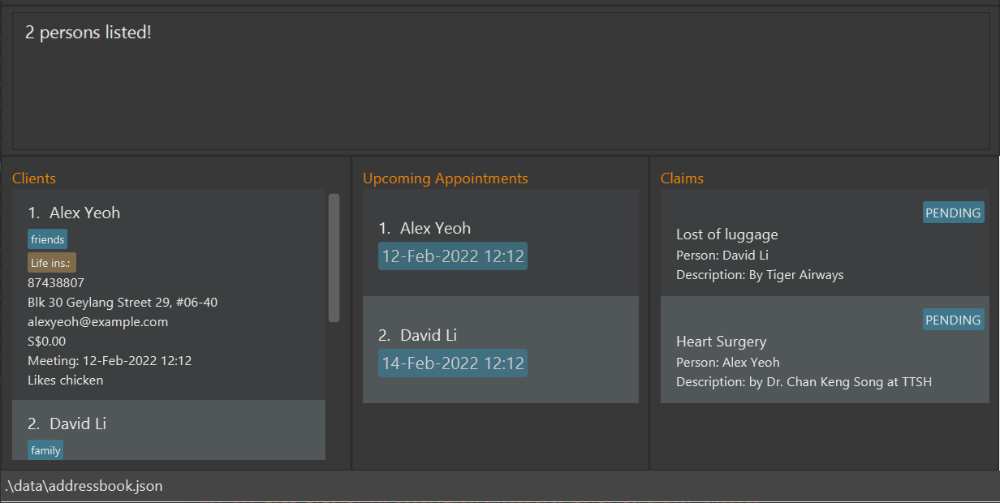
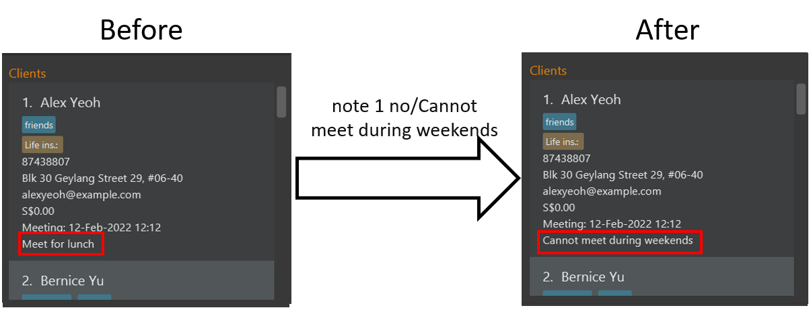
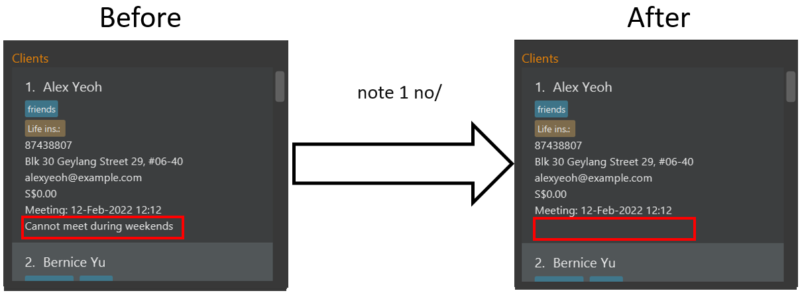

InsurancePal is a client management software specially designed to help manage the logistics of being an insurance agent.

* Table of Contents
{:toc}

--------------------------------------------------------------------------------------------------------------------

## Quick start

1. Ensure you have Java `11` or above installed in your Computer.

1. Download the latest `InsurancePal.jar` from [here](https://github.com/AY2122S1-CS2103T-T17-4/tp/releases).

1. Copy the file to the folder you want to use as the _home folder_ for your InsurancePal.

1. Run `java -jar insurancePal.jar` in the command prompt to start the application. The GUI similar to the below should appear in a few seconds. 

1. Type the command in the command box and press Enter to execute it.

1. Refer to the [Features](#features) below for details of each command.

--------------------------------------------------------------------------------------------------------------------

## Command Summary

Action | Parameters| Description
--------|------------------|-------
`add n/NAME p/PHONE e/EMAIL a/ADDRESS [no/NOTE] [t/TAG]… [i/INSURANCE_TYPE BRAND]…` |`NAME`: Name of the client   `PHONE`: Phone number of the client   `EMAIL`: Email of the client   `ADDRESS`: Address of the client   `NOTE`: Note about the client `TAG`: Tags of the client  `INSURANCE_TYPE`: life/health/general  `BRAND`: Brand of the insurance of the client | Adds a client to InsurancePal
`edit INDEX [n/NAME] [p/PHONE] [e/EMAIL] [r/REVENUE] [a/ADDRESS] [no/NOTE] [t/TAG]… [i/INSURANCE_TYPE BRAND]…` | `INDEX`: Index of the client   `NAME`: Name of the client   `PHONE`: Phone number of the client   `EMAIL`: Email of the client    `REVENUE`: Revenue of the client  `ADDRESS`: Address of the client   `NOTE`:Note about the client   `TAG`: Tags of the client  `INSURANCE_TYPE`: life/health/general  `BRAND`: Brand of the insurance of the client | Edits a client information
`revenue INDEX r/AMOUNT` |  `INDEX`: Index of the client   `AMOUNT`: Change in revenue | Changes the revenue of client by the specified amount
`note INDEX no/NOTE` | `INDEX`: Index of the client   `NOTE`: Note about the client | Add/edit/delete a note of a client
`schedule INDEX m/MEETING_TIME` |`INDEX` Index of the client   `MEETING_TIME`: Time of the meeting | Add/edit/delete a meeting with a client
`claim INDEX n/TITLE [d/DESCRIPTION] [s/STATUS]` |`TITLE`: Title of the claim   `DESCRIPTION`: Description of the claim   `STATUS`: pending/completed | Add/edit/delete a claim of a client
`delete INDEX` | `INDEX`: Index of the client | Deletes a client from InsurancePal
`list` | | Shows a list of all clients in InsurancePal
`clear` | | Deletes all clients from InsurancePal
`find KEYWORD [MORE_KEYWORDS]` | `KEYWORD`: Word to search for | Finds clients whose names contain any of the keywords
{: .summaryTable}

## Application Overview

**Command Box:** You should enter your commands in this input box. More information about the commands can be found in [features](#features) 
**Response Box:** You can see the outcomes of your commands in this text box.  
**Client List:** You can see client information in this list.  
**Upcoming Appointments List:** You can see upcoming appointments in this list. This list is sorted in chronological order. Expired appointments <em>are not</em> shown on this list 
**Claims List:** You can see the information about client's claims in this list. Pending claims are placed before completed claims. The list is <em>not sorted</em> in any other way.

:bulb: **Note:**
The client list, upcoming appointments list and claims list are linked. For example, if you filtered for Alex Yeoh using the [find](#locating-clients-by-name-find) command, only Alex Yeoh's appointments and claims would show up in their respective lists. 

## How to use this guide

In this section, you will find the information you need to use this guide. This section will teach you
how to interpret the command format and access the parameter constraints for each command

### Command Format
* Words in `UPPER_CASE` are the parameters to be supplied by the user. 
  e.g. in `note INDEX no/NOTE`, `NOTE` is a parameter which can be used as `note 1 n/Example note`.

* Items in square brackets are optional. 
  e.g `n/NAME [t/TAG]` can be used as `n/John Doe t/friend` or as `n/John Doe`.

* Items with `…`​ after them can be used multiple times including zero times. 
  e.g. `[t/TAG]…​` can be used as ` ` (i.e. 0 times), `t/friend`, `t/friend t/family` etc.

* Parameters can be in any order. 
  e.g. if the command specifies `n/NAME p/PHONE`, `p/PHONE n/NAME` is also acceptable.

* If a parameter is expected only once in the command but you specified it multiple times, only the last occurrence of the parameter will be taken. 
  e.g. if you specify `p/12341234 p/56785678`, only `p/56785678` will be taken.

* Extraneous parameters for commands that do not take in parameters (such as `help`, `list`, `exit` and `clear`) will be ignored. 
  e.g. if the command specifies `help 123`, it will be interpreted as `help`.

### Parameter Constraints
* You can view the parameter constraints for each command by clicking on the dropdowns in their respective sections. 
  A sample dropdown can be seen below.

Sample dropdown

This is a sample dropdown.

 
* The response box will also display the parameter constraints if an invalid input is provided.
{:width="550px"}

## Features

In this section, you will find information about the commands available for use in InsurancePal. 

### Viewing help : `help`

You can get help by typing in the `help` command. It will show a message explaining how to access the help page.

Format: `help`

### Adding a client: `add`

You can add a client to InsurancePal using the `add` command

Format: `add n/NAME p/PHONE e/EMAIL a/ADDRESS [no/NOTE] [t/TAG]… [i/INSURANCE_TYPE INSURANCE_BRAND]…`

Examples:
* `add n/John Doe p/98765432 e/johnd@example.com a/John street, block 123, #01-01`
* `add n/Betsy Crowe t/friend e/betsycrowe@example.com a/Newgate Prison p/1234567 t/criminal i/life Prudential`

Click here for the parameter constraints!

Parameter | Constraints
---- | ----
`NAME` | {::nomarkdown}<ul><li>Can only contain alphanumeric characters and spaces</li><li>Names must be unique</li><li>Cannot be blank</li></ul>{:/}
`PHONE` | {::nomarkdown}<ul><li>Can only contain numbers</li><li>At least 3 digits long</li></ul>{:/}
`EMAIL` | {::nomarkdown}<ul><li>Emails should be of the format <em>local-part@domain</em></li><li><em>local-part</em> must meet the following constraints<ul><li markdown="1">Only contain alphanumeric characters and these special characters, excluding the parentheses, (+_.-)</li><li>Cannot start or end with any special characters</li></ul></li><li><em>domain</em> must meet the following constraints<ul><li>The domain name is made up of domain labels separated by periods.<li>The domain name must end with a domain label at least 2 characters long</li><li>Domain labels must consist of alphanumeric characters, separated only by hyphens, if any</li><li>Domain labels must start and end with alphanumeric characters</li></li><li>Cannot be blank</li></ul></li></ul>{:/}
`ADDRESS` | {::nomarkdown}<ul><li>Can contain any values</li><li>Cannot be blank</li></ul>{:/}
`NOTE` | {::nomarkdown}<ul><li>Can contain any value, including alphanumeric characters, spaces and punctuations.</li><li>Can be blank</li></ul>{:/}
`TAG` | {::nomarkdown}<ul><li>Can only contain alphanumeric characters</li><li>Must be at most 20 characters long</li><li>Cannot be blank</li></ul>{:/}
`INSURANCE_TYPE` | {::nomarkdown}<ul><li>Limited to the following, with any capitalization: <em>life</em>, <em>health</em>, <em>general</em><em></em></li><li>Cannot be blank</li></ul>{:/}
`INSURANCE_BRAND` | {::nomarkdown}<ul><li>Total length must not exceed 24 characters, including insurance type<em></em></li><li>Can be blank</li></ul>{:/}

:bulb: **Tip:**
A client can have any number of tags (including 0), but cannot have 2 tags with the same name.

### Listing all clients : `list`

Shows a list of all clients in the InsurancePal.

Format: `list`

### Editing a client : `edit`

You can edit an existing client using the `edit` command

Format: `edit INDEX [n/NAME] [p/PHONE] [e/EMAIL] [r/REVENUE] [a/ADDRESS] [no/NOTE] [t/TAG]… [i/INSURANCE_TYPE INSURANCE_BRAND]…`

* At least one of the optional fields must be provided.
* Existing values will be updated to the input values.
* When editing tags or insurances, the existing tags/insurances of the client will be removed i.e adding of tags is not cumulative.
* You can remove all the client’s tags/insurances by typing `t/`/`i/` without
    specifying any tags/insurances after it.

Examples:
*  `edit 1 p/91234567 e/johndoe@example.com` Edits the phone number and email address of the 1st client to be `91234567` and `johndoe@example.com` respectively.
*  `edit 2 n/Betsy Crower t/ i/` Edits the name of the 2nd client to be `Betsy Crower` and clears all existing tags and insurances.

Click here for the parameter constraints!

Parameter | Constraints
---- | ----
`INDEX` | {::nomarkdown}<ul><li>Must be a <em>positive number</em> associated with a client in the displayed client list</li></ul>{:/}
`NAME` | {::nomarkdown}<ul><li>Can only contain alphanumeric characters and spaces</li><li>Names must be unique</li><li>Cannot be blank</li></ul>{:/}
`PHONE` | {::nomarkdown}<ul><li>Can only contain numbers</li><li>At least 3 digits long</li></ul>{:/}
`EMAIL` | {::nomarkdown}<ul><li>Emails should be of the format <em>local-part@domain</em></li><li><em>local-part</em> must meet the following constraints<ul><li markdown="1">Only contain alphanumeric characters and these special characters, excluding the parentheses, (+_.-)</li><li>Cannot start or end with any special characters</li></ul></li><li><em>domain</em> must meet the following constraints<ul><li>The domain name is made up of domain labels separated by periods.<li>The domain name must end with a domain label at least 2 characters long</li><li>Domain labels must consist of alphanumeric characters, separated only by hyphens, if any</li><li>Domain labels must start and end with alphanumeric characters</li></li><li>Cannot be blank</li></ul></li></ul>{:/}
`REVENUE` | {::nomarkdown}<ul><li>Must be a valid float</li><li>Cannot be blank</li></ul>{:/}
`ADDRESS` | {::nomarkdown}<ul><li>Can contain any values</li><li>Cannot be blank</li></ul>{:/}
`NOTE` | {::nomarkdown}<ul><li>Can contain any value, including alphanumeric characters, spaces and punctuations.</li><li>Can be blank</li></ul>{:/}
`TAG` | {::nomarkdown}<ul><li>Can only contain alphanumeric characters</li><li>Must be at most 20 characters long</li><li>Cannot be blank</li></ul>{:/}
`INSURANCE_TYPE` | {::nomarkdown}<ul><li>Limited to the following, with any capitalization: <em>life</em>, <em>health</em>, <em>general</em><em></em></li><li>Cannot be blank</li></ul>{:/}
`INSURANCE_BRAND` | {::nomarkdown}<ul><li>Total length must not exceed 24 characters, including insurance type<em></em></li><li>Can be blank</li></ul>{:/}

### Locating clients by name: `find`

You can easily find clients with the `find` command. 

Format: `find KEYWORD [MORE_KEYWORDS]`

* The search is case-insensitive. e.g `hans` will match `Hans`
* The order of the keywords does not matter. e.g. `Hans Bo` will match `Bo Hans`
* Only the name is searched.
* Only full words will be matched e.g. `Han` will not match `Hans`
* Clients matching at least one keyword will be returned (i.e. `OR` search).
  e.g. `Hans Bo` will return `Hans Gruber`, `Bo Yang`

Examples:
* `find John` returns `john` and `John Doe`
* `find alex david` returns `Alex Yeoh`, `David Li` 
  

Click here for the parameter constraints!

Parameter | Constraints
---- | ----
`KEYWORD` and `MORE_KEYWORDS`|   {::nomarkdown}<ul><li>Can contain any values except blank spaces</li></ul>{:/}

### Deleting a client : `delete`

You can delete a client with the `delete` command.

Format: `delete INDEX`

Examples:
* `list` followed by `delete 2` deletes the 2nd client in InsurancePal.
* `find Betsy` followed by `delete 1` deletes the 1st client in the results of the `find` command.

Click here for the parameter constraints!

Parameter | Constraints
---- | ----
`INDEX` | {::nomarkdown}<ul><li>Must be a <em>positive number</em> associated with a client in the displayed client list</li></ul>{:/}

### Clearing all entries : `clear`

Clears all clients from InsurancePal

Format: `clear`

### Add/Edit/Delete a claim: `claim`

You can use the `claim` command to add, edit or delete a claim. You can view the parameter constraints below. 

Click here for the parameter constraints!

Parameter | Constraints
---- | ----
`INDEX` | {::nomarkdown}<ul><li>Must be a <em>positive number</em> associated with a client in the displayed client list</li></ul>{:/}
`TITLE` | {::nomarkdown}<ul><li>Can only contain alphanumeric characters.</li><li>Case-sensitive</li><li>Cannot be blank.</li></ul>{:/}
`DESCRIPTION` | {::nomarkdown}<ul><li>Can only contain alphanumeric characters, blank spaces and punctuations</li><li>Cannot be blank.</li></ul>{:/}
`STATUS` | {::nomarkdown}<ul><li>Limited to the following, with any capitalization: <em>pending</em>, <em>completed</em></li><li>Cannot be blank</li></ul>{:/}

#### Adding a claim
You can add a claim by providing the client index, a title, description and status. A client cannot have 2 claims with the same title. If the client has a claim with the same title you provided, the claim would be edited instead.

Format: `claim INDEX n/TITLE d/DESCRIPTION s/STATUS`

Example:
* If the first client <em>does not</em> have a claim titled "Heart Surgery",  `claim 1 n/Heart Surgery d/At TTSH s/Pending` will add a new claim with the corresponding values.
  
{:width="650px" .center-image}

#### Editing a claim
You can edit a claim by providing the client index, the title of the client's existing claim, followed by any modifications to the description and/or status you wish to make. 
If both description and status is not provided, the claim is deleted instead. 

Format: `claim INDEX n/TITLE [d/DESCRIPTION] [s/STATUS]`

Example:
* If the first client has a claim titled "Knee Surgery",   `claim 1 n/Knee Surgery d/Due to a fall` will change the description of the claim to "Due to a fall" while leaving the claim's status unmodified. 

{:width="650px" .center-image}

#### Deleting a claim
You can delete a claim by providing the client index and the title of the client's existing claim.

Format `claim INDEX n/TITLE`

Example:
* If the first client has a claim titled "Knee Surgery",  `claim 1 n/Knee Surgery` will delete that claim.

{:width="650px" .center-image}

### Add/Edit/Delete a note: `note`
You can use the `note` command to add, edit or delete notes. You can view the parameter constraints below.

Click here for the parameter constraints!

Parameter | Constraints
---- | ----
`INDEX` | {::nomarkdown}<ul><li>Must be a <em>positive number</em> associated with a client in the displayed client list</li></ul>{:/}
`NOTE` | {::nomarkdown}<ul><li>Can contain any value, including alphanumeric characters, spaces and punctuations.</li><li>Can be blank</li></ul>{:/}

#### Adding a note
You can add a note by providing a client index and the contents of the note. Each client can only store one note. If a client has a pre-existing note, that note will be edited instead.

Format: `note INDEX no/NOTE`

Example: 
* If the first client does not have a note,  `note 1 no/Meet for lunch` will add a note to first client with the contents of "Meet for lunch".

{:width="650px" .center-image}

#### Editing a note
You can edit a note by providing a client index and the new contents of the note. 

Format: `note INDEX no/NOTE`

Example:
* If the first client has an existing note, `note 1 no/Cannot meet during weekends` will update the contents of the existing note to be "Cannot meet during weekends"

{:width="650px" .center-image}

#### Deleting a note
You can delete a note by providing a client index and an empty note field. 

Format: `note INDEX no/`

Example:
* If the first client has an existing note, `note 1 no/` will remove that note.

{:width="650px" .center-image}

### Add/Edit/Delete appointments: `schedule`
You can use the `schedule` command to add, edit or delete appointments. You can view the parameter constraints below

Click here for the parameter constraints!

Parameter | Constraints
---- | ----
`INDEX` | {::nomarkdown}<ul><li>Must be a <em>positive number</em> associated with a client in the displayed client list</li></ul>{:/}
`MEETING_TIME` | {::nomarkdown}<ul><li>Must be the format <code>dd-mmm-yyyy hh:mm</code></li><li> Can be blank</li></ul>{:/}

#### Adding an appointment
You can add an appointment by providing a client index and meeting time (`dd-mmm-yyyy hh:mm`). Each client can only store one appointment. If a client has a pre-existing appointment, that appointment will be updated instead.

Format: `schedule INDEX m/MEETING_TIME`

Example: 
* If the first client does not have an appointment, `schedule 1 m/05-feb-2022 15:30` will add an appointment to the first client with a meeting time on 5th February 2022 at 3.30pm.

{:width="700px" .center-image}

#### Editing an appointment
You can edit an appointment by providing a client index and the new meeting time. 

Format: `schedule INDEX m/MEETING_TIME`

Example: 
* If the first client has an existing appointment, `schedule 1 m/05-Dec-2021 20:00` will update the appointment time to 5th December 2021 8pm

{:width="700px" .center-image}

#### Deleting an appointment
You can delete an appointment by providing a client index and an empty meeting time field.

Format: `schedule INDEX m/`

Examples:
* If the first client has an existing appointment, `schedule 1 m/` will delete that appointment. 

{:width="700px" .center-image}

### Modifying revenue: `revenue`
You can use the `revenue` command to modify the revenue of a client.

Format: `revenue INDEX r/AMOUNT`

* Existing value will be updated with the current value added to the `AMOUNT` given.
* Default value for revenue of a client will be 0 when he/she is added to the address book.
* Revenue of an existing client in the address book should never be **negative**.

Examples:
* `revenue 1 r/100.95` will update the revenue of first client in the contact list to be `100.95`. (Assuming revenue of
the first client in the contact list was 0).

{:width="650px" .center-image}

* `add n/Betsy Crowe t/friend e/betsycrowe@example.com a/Newgate Prison p/1234567 t/criminal` (Assuming Betsy Crowe is
the second client in the contact list) followed by `revenue 2 r/350` and followed by `revenue 2 r/-100.11` will update the
revenue of Betsy Crowe to be `249.89`.

{:width="700px" .center-image}

Click here for the parameter constraints!

Parameter | Constraints
---- | ----
`INDEX` | {::nomarkdown}<ul><li>Must be a <em>positive number</em> associated with a client in the displayed client list</li></ul>{:/}
`REVENUE` | {::nomarkdown}<ul><li>Can be any float value up to 2 decimal places. E.g 100, 250.11, 500</li><li>Can be negative. E.g -90.10</li><li>Cannot be blank</li></ul>{:/}

### Exiting the program : `exit`

Exits the program.

Format: `exit`

### Saving the data

InsurancePal data are saved in the hard disk automatically after any command that changes the data. There is no need to save manually.

### Editing the data file

InsurancePal data are saved as a JSON file `[JAR file location]/data/addressbook.json`. Advanced users are welcome to update data directly by editing that data file.

:exclamation: **Caution:**
If your changes to the data file makes its format invalid, InsurancePal will discard all data and start with an empty data file at the next run.

--------------------------------------------------------------------------------------------------------------------

## FAQ

**Q**: How do I transfer my data to another Computer? 
**A**: Install the app in the other computer and overwrite the empty data file it creates with the file that contains the data of your previous InsurancePal home folder.

